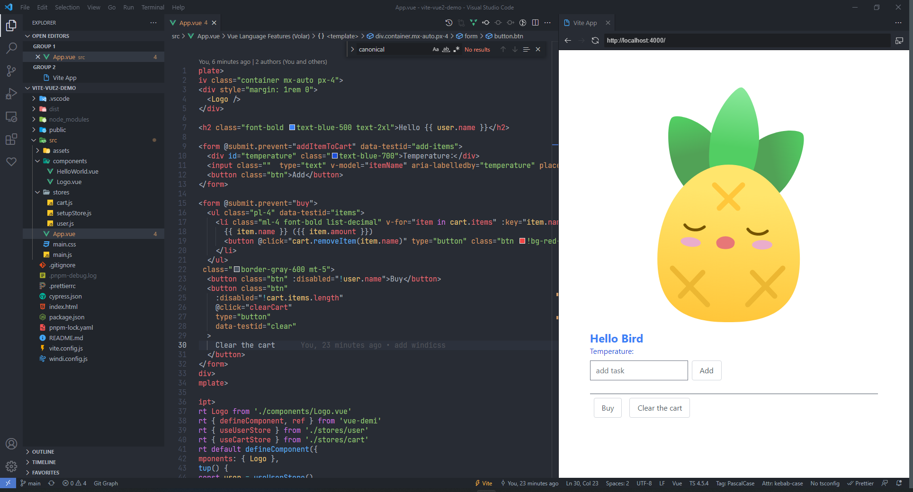
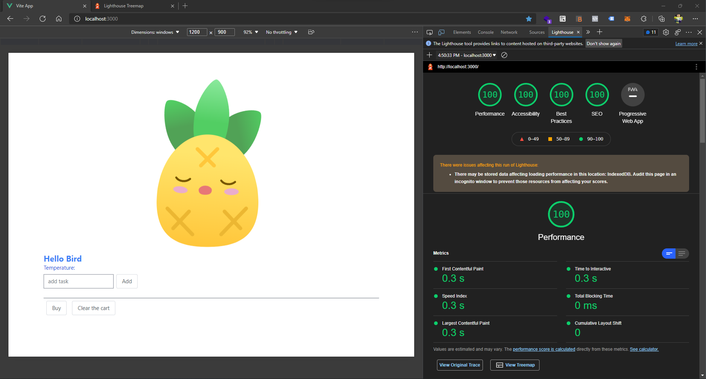

# Vite Vue 2 Demo

## Recommended IDE Setup

- [VSCode](https://code.visualstudio.com/) + [Volar](https://marketplace.visualstudio.com/items?itemName=johnsoncodehk.volar)

## Feature

- [x] Vue 2
- [x] Vite
- [x] Windicss
- [x] Pinia
- [ ] Vitest
- [ ] Cypress

## Screenshot

```sh
yarn dev
```

<p align="center">

</p>

```sh
yarn build && yarn start
```

<p align="center">

</p>
